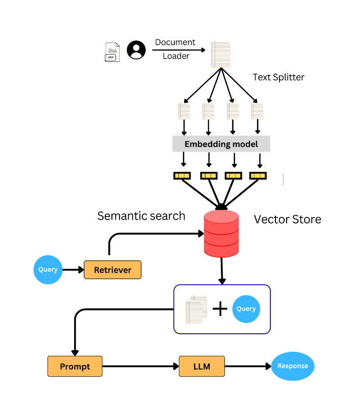

# APCAS (Any PDF Chatting AI System)

> [Take a live demo now!](https://apcass.streamlit.app)

APCAS stands for Any PDF Chatting AI System, it is basically a RAG (Retrieval Augmented Generation) based
application, that optimized for chatting with any PDF in an efficint way, still it is not a professional 
project So it may have several bugs.


> [!NOTE]
> Your Ideas, Sugestions, Contributions always welcome 😃 here.

## Technologies used in this Project
- Langchain
- Gemini LLM APIs
- Version Control (Git & Github)
- Web Application (Using Streamlit)
- OOPs (Object Oriented Programming System)
- Python with its libraries and some more techs


## How to use locally?
### Step 1) Clone Repo
```
git clone https://github.com/a4archit/apcas.git
```

### Step 2) Install dependencies
```
pip install -r requirements.txt
```

### Step 3) Add `.env` file
Create `.env` file in dir(`./APCAS/.env`), then add your `gemini-1.5-flash` model's API key as:
```
GOOGLE_API_KEY = "Your_API_Key"
```

### Step 4) Activate Stremalit server
Run this command in `./APCAS`
```
streamlit run main_app.py
```

## Working Directory

    APCAS
    ├── apcas.py
    ├── home_page.py
    ├── main_app.py
    ├── materials
    │   └── working_flow_diagram.png
    ├── requirements.txt
    ├── user_uploaded_file.pdf # it will create when user upload a file
    └── working_page.py


## Working Flow


Example:
```
  from apcas import APCAS
  # creating model instance
  model = APCAS('path_of_pdf')
  # running on terminal
  model.run_on_terminal()
```

### Social Accounts
| [Kaggle](https://www.kaggle.com/architty108) | [Github](https://www.github.com/a4archit) | [LinkedIn](https://www.linkedin.com/in/a4archit) |
|----------------|---------------|---------------|


